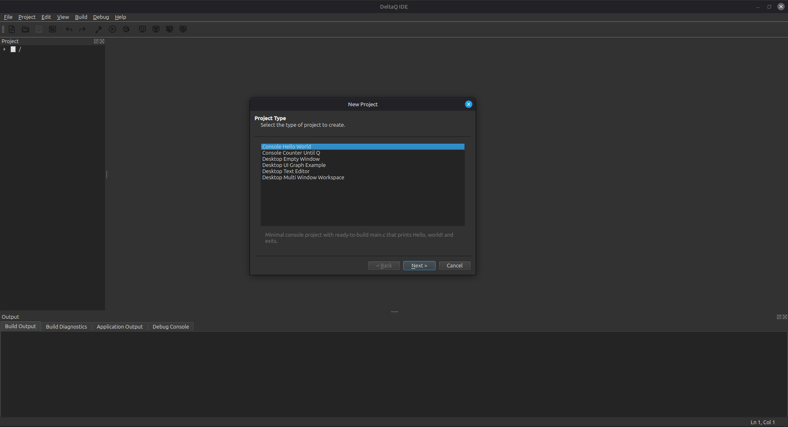
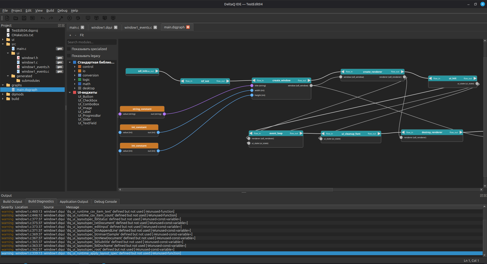
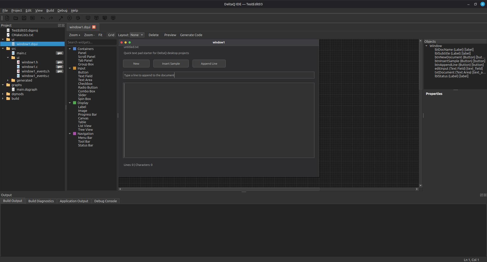
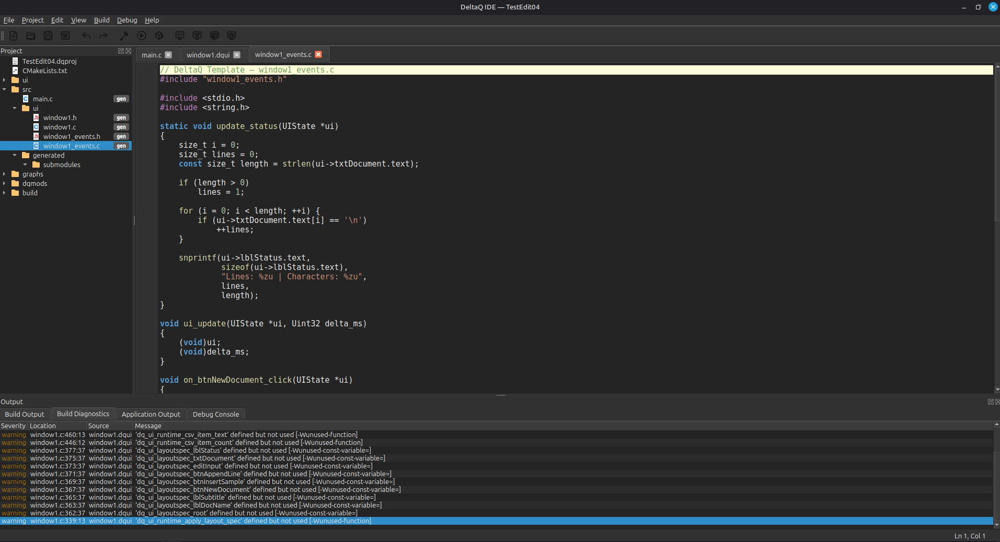
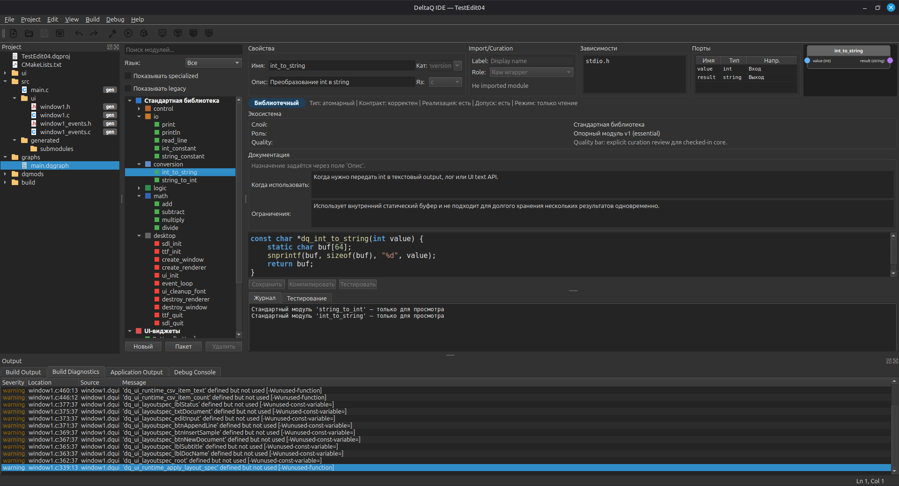
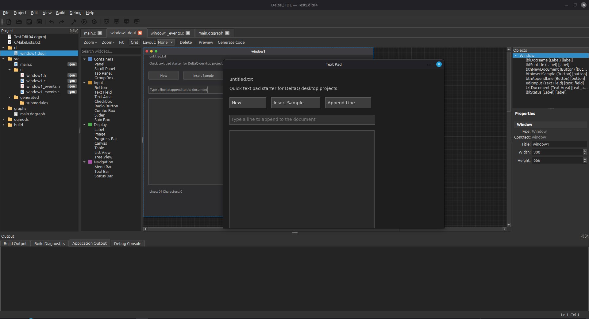

# Release And CI

Current release framing:

- **Linux release candidate**
- Linux-only scope; Windows/macOS remain roadmap delivery targets
- current imported-pack claim remains Linux-first `C ABI` intake rather than universal ABI wrapping

## Linux CI Baseline

DeltaQ now has a checked-in GitHub Actions workflow at `.github/workflows/ci.yml`.

It runs a full Linux baseline on `ubuntu-24.04`:

- installs the Qt6 / QScintilla / libclang / SDL2 dependencies;
- installs Qt translation tools so packaged builds contain compiled `.qm` files;
- configures the project with CMake and Ninja;
- builds the whole repository with tests enabled;
- runs the full `ctest` suite in headless mode via `QT_QPA_PLATFORM=offscreen`;
- performs install/package smoke checks for the self-contained bundle layout;
- builds an `AppDir` smoke package on every CI run.

## User-Facing Entry Points

If you are validating DeltaQ as a Linux user or reviewer rather than changing packaging internals, start with:

- `docs/onboarding/README.md`
- `resources/examples/README.md`
- `docs/release/linux_first_release_checklist.md`

## Visual Proof

The screenshots below are the current Linux-first public-facing proof set.

### 1. Create Or Open A Project



### 2. Program Modules In The IDE



### 3. Move Between Code And UI Work



### 4. Build Feedback Stays Inside The IDE



### 5. Compose Logic Visually



### 6. Run The Exported Result



## Local Release Bundle

For a local Linux release build, use:

```bash
./scripts/build_release.sh --package
```

The script now assembles the release through `cmake --install`, so the produced bundle matches the runtime layout expected by the IDE:

- `deltaq`
- `LICENSE`, `README.md`, `README_RU.md`
- `modules/`
- `templates/`
- `examples/`
- `translations/`
- `VERSION`

Release layout verification is centralized in `scripts/verify_release_bundle.sh`. CI uses the same script against `build/ci-linux/install-smoke`, and `build_release.sh` runs it against the final release directory in `build/release/DeltaQ`.

The Linux release path now also has an automated first-run smoke:

- `scripts/smoke_linux_first_run.sh <bundle_dir>` launches `deltaq` from the assembled bundle with an isolated `DELTAQ_HOME`;
- the script verifies that first launch creates `config/settings.ini` and installs the bundled `core` pack into the writable user root;
- by default it forces `QT_QPA_PLATFORM=offscreen`, so the smoke stays deterministic in CI and other headless environments;
- if a different Qt platform backend is needed, it can still be overridden explicitly via `QT_QPA_PLATFORM`.

There is now also a release-bundle example smoke:

- `scripts/smoke_linux_example_build_run.sh <bundle_dir> [example_name]` copies a checked-in example out of the bundled `examples/` tree into a writable temporary workspace;
- DeltaQ is then launched with internal startup automation flags to:
  - open the copied `.dqproj`;
  - run `build`;
  - run the resulting executable;
  - verify expected stdout from the example and exit with a deterministic status code;
- by default the smoke uses `minimal_console_flow`, writes `DeltaQ\n` to stdin, and checks for:
  - `Hello from DeltaQ!`
  - `DeltaQ`

This keeps the verification honest for Linux release artifacts: the bundle is tested not only for layout and first launch, but also for a real `open example -> build -> run` loop.

Writable state is kept outside the bundled tree:

- settings and session state go to `~/.deltaq/config/`;
- installed module packs go to `~/.deltaq/modules/`;
- `DELTAQ_HOME` can override that root for isolated environments.

## Package Artifacts

Both CI and local `build_release.sh --package` now emit:

- the Linux `.tar.gz` package;
- `SHA256SUMS` for the generated archive.

GitHub Actions uploads the package and checksum as the `deltaq-linux-package` artifact for each workflow run.

Package verification is two-stage:

- `scripts/verify_release_bundle.sh` checks an install-layout directory;
- `scripts/verify_package_archive.sh` validates `SHA256SUMS`, extracts the tarball, and re-runs bundle verification on the unpacked release.

## Project Export Artifacts

DeltaQ now also has a separate Linux artifact path for user projects built inside the IDE.

The user-facing path is:

- open a DeltaQ project;
- run `Build -> Export Linux Bundle`;
- hand off either:
  - `dist/<ProjectName>/`
  - `dist/<ProjectName>.tar.gz`

Verification is also two-stage:

- `scripts/verify_project_export_bundle.sh` checks the directory bundle;
- `scripts/verify_project_export_archive.sh` extracts the archive and re-runs bundle verification.

CI now also exercises this user-project path through IDE startup automation via:

- `scripts/smoke_linux_example_export.sh build/ci-linux/install-smoke minimal_console_flow`
- `scripts/smoke_linux_example_export.sh build/ci-linux/install-smoke desktop_ui_flow`

For the user-facing acceptance path and current `v1` limitations, use:

- `docs/release/linux_project_export_checklist.md`

## AppImage

Linux AppImage packaging now has two layers:

- `scripts/build_appimage.sh --appdir-only` builds and verifies an `AppDir` locally;
- `scripts/build_appimage.sh --runtime-file <path>` can build a fully local `.AppImage` without relying on `appimagetool` runtime auto-download;
- `.github/workflows/release.yml` downloads `linuxdeploy`, the Qt plugin, `appimagetool`, and the AppImage runtime, then publishes a real `.AppImage` on tagged releases.

For headless or offline-safe local packaging, `build_appimage.sh` also forces AppImage tools into extract-and-run mode and injects an `appstreamcli --no-net` wrapper, so local validation does not fail just because DNS is unavailable during metadata checks.

## Build Workspace Layout

The repository now keeps `build/` as a container for named workspaces instead of mixing a live CMake tree with release artifacts in the same root:

- `build/qt-dev/` — local development / Qt Creator build tree;
- `build/release/` — release workspace with `cmake/`, `DeltaQ/`, `package/`, `appimage/`, and `tools/`;
- `build/ci-linux/` — CI configure/build/test/install/package workspace.

The AppImage bundle now also includes Qt's `offscreen` platform plugin explicitly, so extracted `.AppImage` contents can pass the same headless first-run and example smoke path as the plain Linux release bundle.

AppImage verification is also two-stage:

- `scripts/verify_appdir.sh` checks the prepared `AppDir`, then runs both:
  - isolated first-run smoke;
  - copied example `open -> build -> run` smoke
  against `AppDir/usr/bin`;
- `scripts/verify_appimage_file.sh` validates the checksum, extracts the `.AppImage`, and re-runs `verify_appdir.sh` on the unpacked image, so extracted AppImage contents go through the same runtime verification path as the plain release bundle.

This is now confirmed on a freshly built local `.AppImage`, not only on `AppDir` or CI scaffolding.

The AppDir now also includes AppStream metadata at `usr/share/metainfo/org.deltaq.deltaq.appdata.xml`, so the final `.AppImage` is built with desktop metadata rather than a warning-only fallback.

## Tagged Releases

The repository now also contains `.github/workflows/release.yml`.

On pushing a tag like `v0.1.0`, GitHub Actions will:

- rebuild the Linux package from scratch;
- run the full test suite before packaging;
- generate `SHA256SUMS` for both `.tar.gz` and `.AppImage`;
- upload the `.tar.gz`, `.AppImage`, and checksum both as workflow artifacts and as GitHub Release assets.

If the script runs in a headless environment and `QT_QPA_PLATFORM` is not set, it automatically switches tests to `offscreen`.
